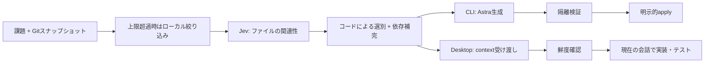

# Astra + Jev：CodexエージェントスキルとCLIハーネス

[English](README.md) · [バージョン 0.3.0](VERSION) · [タグ付きリリース](https://github.com/Oranquelui/astra-jev-harness/releases) · [変更履歴](CHANGELOG.md)

このリポジトリは、**Codex Desktop用の[`astra-jev-coding`エージェントスキル](desktop/skills/astra-jev-coding/SKILL.md)**と、別方式のCodex CLI用ハーネスを配布します。DesktopではJevが読むファイルを選び、現在の会話モデルが実装します。CLI版は別プロセスでCodexを実行します。

**大きなrepoでは先に候補を絞り、Jevが候補を判断し、Astraがコードを書く。**

Codex CLIとCodex Desktop向けのローカルCoding Harnessです。「公開APIを変えずにページングを修正して」といった課題から、対象ファイルをスナップショット化し、大きなrepoでは候補をローカルで絞ってからJevが関連性を判断します。依存ファイルを補い、何を残したか、その理由も記録します。

**実験段階です。** v0.3.0では判定範囲を広げ、本文と費用の集計を明確にしました。**今回の更新によるAstra全体のtoken・総費用の削減率は未実証です。** 後述の「Astra入力1.2%減」は今回より前の測定です。[測定条件と結果](docs/BENCHMARKS.md)。

## v0.3.0で何が改善したか

| 項目 | v0.2.0 | v0.3.0 |
|---|---|---|
| 22 KB超の適格ファイル | Jevで判定せず保持 | 全範囲を予算内で分割判定。不確実・判定漏れがあれば全文保持 |
| Desktopへの引き渡し | Skillが選択済み全文を読む | 本文を会話へ出す前に選別し、必要な行だけ読む |
| 小さいDesktop課題 | 判定可能なファイルがあれば`select`でJevを使う | Skillは`--mode auto`を推奨。本文12,000 bytes未満なら全候補保持・Jev 0回。コマンドの既定は`jev`を維持 |
| 使用量・費用 | プロバイダー別token合計。費用見積なし | 通常入力・cache read/write・不明分を分離。任意のモデル別単価で見積 |

Codex Desktop Skillを更新し、全範囲判定と集計はCLIでも使えます。旧planの再現性は維持します。同じJevリクエストの応答再利用はv0.1.0からの機能であり、**v0.3.0で新たに得た節約効果には数えません**。[更新の詳細](docs/CONTEXT-BUDGETS.md) · [変更履歴](CHANGELOG.md)。

## 評価資料を使ったCoding（実験機能）

原文・行番号・出典hashを保ちながら評価資料を選別し、CLI/Desktopへ渡せます。失敗・予算の記録は明示的に固定し、同一Jevリクエストの再利用と保存runの使用量比較にも対応しました。[使い方と制限](docs/EVIDENCE.md)。

## CLIとDesktopの違い

| | Codex CLI | Codex Desktop app |
|---|---|---|
| コードを書くモデル | 別プロセスのCodex CLIのAstra | 現在の会話モデル。Astra方式では会話側でAstraを選択 |
| Jevの役割 | 生成前のコンテキスト選別 | 現在の会話が読むファイルの選別 |
| 手順 | `plan → run → verify → apply` | `plan → select → check → 会話で実装・テスト` |
| 対象への書き込み | 検証後の明示的な`apply` | Desktopの通常の編集ツール |
| 入口 | `python3 cli/main.py` | `python3 desktop/context.py`またはSkill |

Desktop版はコード生成のために別のCodex CLIを起動しません。どちらもCodexのModelメニューへJevを登録する機能ではありません。

## はじめに

必要なのはPython **3.10以上**、Git、自分のTypeSafe APIキー、Codexです。追加Pythonライブラリは不要です。ローカル実動作の確認環境はmacOS・Python 3.14・Codex CLI 0.153.2です。他のOSやCodexバージョンの動作をこの測定で保証するものではありません。CLI生成には自分のCodexアカウントで`gpt-6-astra`を利用でき、`codex sandbox`が動く必要があります。使用するCodexのフラグはバージョンに依存します。

```sh
git clone https://github.com/Oranquelui/astra-jev-harness.git
cd astra-jev-harness
python3 -m unittest -v
```

**認証情報は利用者自身のものを使います。**

```sh
# 自分の環境で置き換えるか、secret managerから環境変数へ供給してください。
export TYPESAFE_API_KEY="YOUR_OWN_TYPESAFE_API_KEY"

# CLIで生成する場合だけ、必要に応じて自分のCodexアカウントへログイン。
codex login
python3 cli/main.py doctor
```

作者のAPIキー、Codexログイン、Cookie、認証ファイルは配布物に含まれません。実キーをGitへ追加しないでください。`doctor`はキーの値を表示せず、外部APIも呼びません。環境変数を優先し、macOSでは設定済みのlogin Keychain（service `astra-jev-harness`、account `TYPESAFE_API_KEY`）も使用できます。installerはそのキーの作成や他人のアカウントの共有を行いません。

### Codex Desktopで使う

```sh
python3 install.py --check
python3 install.py
```

`$CODEX_HOME/skills`（既定`~/.codex/skills`）へDesktop用Skillの参照リンクだけを作成します。別のSkillの上書きは拒否し、モデル設定を変更したりログインを読み取ってコピーしたりしません。cloneしたディレクトリは残してください。アンインストール時はinstallerが作った`astra-jev-coding`のsymlinkだけを削除します。候補に反映されなければ新しいCodexタスクを開いてください。

対象リポジトリをDesktopで開き、依頼します。

```text
$astra-jev-coding この課題をAstra＋Jevで実装してください。対象は現在のcheckoutです。
```

Skillが課題・repo指示・送信対象を確認し、選別と鮮度確認を行った後、この会話で実装を続けます。Desktopプロセスからシェルの環境変数が見えない場合は、キー設定済みterminalでhelperを実行するか、任意のKeychain読み込みを使用してください。別terminalの`export`だけでは起動済みDesktopアプリの環境は変わりません。

### CLIで試す：合成リポジトリ

cloneしたルートから実行します。plan/runの出力先は対象repo外の、まだ存在しないディレクトリを指定します。

```sh
DEMO_ROOT=$(mktemp -d)
python3 make_demo.py "$DEMO_ROOT/repo"
printf '%s\n' 'page_itemsを修正。ページ番号は1始まり。pageと明示的sizeは1以上へ補正し、sizeがNoneのときだけDEFAULT_PAGE_SIZEを使う。APIとテストを保持する。' > "$DEMO_ROOT/task.txt"

# ローカル確認のみ。外部送信前にPLAN.mdを読む。
python3 cli/main.py plan --repo "$DEMO_ROOT/repo" \
  --task-file "$DEMO_ROOT/task.txt" --out "$DEMO_ROOT/plan"

# 外部プロバイダー利用：最大Jev 24回、Astra生成2回。
python3 cli/main.py run --plan "$DEMO_ROOT/plan" \
  --out "$DEMO_ROOT/run" --mode jev \
  --verify-json '["python3", "-B", "-m", "unittest", "discover"]'

# REPORT.md、changes.diff、検証出力を確認してから適用。
python3 cli/main.py apply --run "$DEMO_ROOT/run"
```

`run`は対象外に候補を作ります。`apply`は検証済みで改変のない成果物だけを適用し、コミットしません。`verify --run ...`はモデルを再呼び出さず検証できます。新規ファイルは`plan --allow-create path`、既存テスト更新は`--allow-test-edit path`で明示します。[CLIの詳細](docs/CLI.md)。

## 特徴

本文を会話へ読む前に選別し、`read --selection /absolute/selection --path src/main.py --start-line 1 --end-line 80`で必要行だけ取得できます。`select --mode auto`は12,000本文bytes未満ならJevを省略、`--mode local`は明示的に省略します（既定は`jev`）。cache read/writeの集計と任意単価での費用見積を追加しました。[動作・制限](docs/CONTEXT-BUDGETS.md)。

- **上限のある選別**：対象ファイルの全範囲を分割し、質問を含む予算内でバッチにまとめます。不確実な判断ではコンテキストを残し、解決できるPython/相対JavaScript依存、設定、repo指示を補います。
- **判定の可視化**：範囲ごとの確率・ファイルの保持理由・判定漏れ・本文バイト数を記録します。関連性は安全性の判定ではありません。
- **API再呼び出しなしの比較**：保存済み判断から方式を比較します。独立に特定した必要パスはplan内と`scoped_out`の両方を指定でき、ローカル絞り込みとJev選別の取りこぼしを分けて確認できます。ラベルがなければ保持率は不明です。
- **鮮度確認**：DesktopはHEAD・branch・status・本文・モードとplan/contextの整合を確認します。過去の結果の比較は古いcontextの利用許可ではありません。
- **適用範囲の制限**：CLIはCodexのread-only sandboxで候補を検証し、整合確認後、許可した編集を衝突検査・復旧記録付きで適用します。
- **失敗の記録**：サービスの自動再試行はありません。CLIは全候補を含むAstraプロンプトをシリアライズして500,000バイト上限をJev呼び出し前に確認します。Desktopは試行/完了を保存し、同一出力先の再利用を拒否します。応答のない試行も課金される可能性があります。

```sh
python3 desktop/context.py plan --repo /absolute/repo \
  --task-file /absolute/task.txt --out /absolute/plan
python3 desktop/context.py select --plan /absolute/plan \
  --out /absolute/selection --max-calls 4 --mode auto
python3 desktop/context.py check --selection /absolute/selection
python3 desktop/context.py compare --selection /absolute/selection \
  --required-file src/main.py
```

既定の`batch`は1件でも不確実ならバッチ全体を残します。実験用`select --policy per-file`は不確実/未判定を残しつつ、同バッチ内の明確に無関係なファイルを省きます。依存の補完と全件不一致時の全保持は維持します。変更前に比較し、バイト数の減少だけで正しさを判断しないでください。

## 大きなリポジトリ

適格ファイルが**2,000,000バイト・1,500ファイル・予定呼出数のいずれかの上限を超える**場合、`plan`はJevを呼ぶ前に、課題文とファイルの語の一致から候補を**ローカルで**絞ります。Desktopのplanは最大2,000,000バイト、CLIはAstraへ送るプロンプトの別上限500,000バイトに余地を残すため、絞り込み後の候補を350,000バイト以内に抑えます。すべての上限内なら全文候補を維持します。候補に残すファイルの本文を黙って切り詰めません。

課題に必要と分かっている適格ファイルは、繰り返し指定できる`--focus-file`で固定します。`--scope-max-calls`は候補全体の**計画上の**Jevリクエスト数の上限です（既定4回、範囲1〜24回）。後の`select --max-calls`による実行上限とは別です。未追跡ファイルは引き続き`--include-file`が必要です。`--focus-file`でも適格性や1ファイル100 KBの上限は迂回できません。

```sh
python3 desktop/context.py plan --repo /absolute/repo \
  --task-file /absolute/task.txt --out /absolute/plan \
  --focus-file src/pagination.py --focus-file tests/test_pagination.py \
  --scope-max-calls 4
```

同じplan用の2つのフラグを`cli/main.py plan`でも使えます。送信前に`PLAN.md`を確認してください。元の適格ファイル数/バイト数、絞り込み対象外のパス/バイト数、予定Jev呼び出し数を示します。`plan.json`の`scope`が集計、`scoped_out`が対象外の適格ファイルの情報です。**これらのファイルをJevは判定していません**。保護規則で除かれた`excluded`や、Jevが無関係と判定したファイルとも異なります。AGENTS.md・主要設定・解決できる依存は候補に残します。この語の一致は翻訳しないため、ASCIIのパスや識別子を含まない日本語だけの課題では`--focus-file`が必要になる場合があります。課題とファイルの一致がなく**必須パスの明示もない場合**、または必須ファイルが上限に収まらない場合はplanが停止するため、課題またはfocus pathを具体化してください。必要ファイルの保持率とAstraトークンへの効果は、独立した測定なしには分かりません。[設計とTypeSafe公式資料](docs/DESIGN.md)。

## トークンはどれだけ減るか

### v0.2.0 → v0.3.0：同じ合成入力の比較

2ファイルの合成例を、同じ課題・本文hash・保守的な`batch`方式で比較しました。`main.py`は必要ファイルとして明示固定しています。コード修正完了までの比較ではなく、選別の動作確認です。

| 選別で測定した項目 | v0.2.0 | v0.3.0 |
|---|---:|---:|
| 全体を判定できたファイル | 1 / 2 | 2 / 2 |
| 保持する本文bytes | 27,353 | 75 |
| 実Jevリクエスト | 1回 | 2回 |
| Jev入力token | 392 | 6,784 |
| Jev出力token | 21 | 76 |
| Jev API費用の見積 | $0.000016464 | $0.000284928 |

以前は未判定だった無関係の27,278 bytesを判定して除外でき、**この単純な合成例の保持本文は99.73%減**りました。これはtoken削減率ではありません。判定対象を増やした分、Jev費用の見積は**$0.000268464増加**しています。Astra側でそれ以上節約できるかは、キャッシュや後続の再読込も含めて未測定です。見積は実際のJev入力tokenに、2026-09-24確認の**100万入力tokenあたり$0.042・出力無料**を適用したもので、請求額ではありません。[公式単価](https://docs.typesafe.ai/models)。

別の75 bytesの合成例では、新しい`auto`方式が**Jev 0回**で本文を保持し、選別の追加呼び出しを省略しました。いずれもDesktop会話全体やCodex契約枠の消費は測定していません。[方法・制限・比較式](docs/BENCHMARKS.md#v030-upgrade-check--2026-09-24) · [集計データ](benchmarks/context-selection-v0.3.0.json)。

### 過去のAstra生成比較：v0.3.0の改善率ではありません

過去の条件調整後の再測定です。小規模なPython合成3課題、各方式1試行、同じAstraモデル・reasoning設定で、両方式とも22件の動作確認を通過しました。

| 指標（3課題合計） | Astra単独 | Astra＋Jev | 実測差 |
|---|---:|---:|---:|
| Astraへ送った候補ファイル | 28 | 4 | **85.7%減** |
| Harnessが作ったプロンプト文字数 | 4,309 | 2,581 | **40.1%減** |
| Astra報告入力トークン | 42,714 | 42,199 | **1.2%減** |
| Astra報告出力トークン | 175 | 175 | 同じ |
| 実行時間 | 18.51秒 | 21.53秒 | **16.3%増** |
| Jev入力トークン | ― | 4,094 | 別プロバイダーの使用量 |

この値は**配布版の全機能を測定したものではありません**。費用、Codex週次上限、Desktop会話全体のトークン削減は未測定です。異なるプロバイダーのトークン数を足して価格を推定しないでください。ファイル選別では、Codex共通の指示・ツール・既存の会話履歴は減らせません。[方法・制約・追加の選別結果・再実行手順](docs/BENCHMARKS.md)／[集計データ](benchmarks/results-2026-09-22.json)。

## 仕組み



`shared/`はTypeSafe通信・snapshot・選別・資格情報の取得、`cli/`は生成・候補検証・適用、`desktop/`はcontext受け渡しとSkillを担当します。rootスクリプトは互換入口です。JevはNoulのyes/no形式で関連性を判断し、コードは生成しません。回数・パス等の制約はコードが管理します。

## 外部へ送信される情報

`plan`・`check`・`read`・`compare`はローカル処理です。Jevを使う場合、`select`は課題・相対パス・対象ソース本文をTypeSafeへ送り、ローカルで`scoped_out`になったファイルの本文はJevへ送りません。CLI生成は選別したcontextに加え、対象外ファイルの**名前**を最大512件と総件数を自分のログインでCodexへ送ります。Astraが不足を示した場合に新しいplanを作れるようにするためです。HarnessはAstra子プロセスの環境から`TYPESAFE_API_KEY`・`OPENAI_API_KEY`・`CODEX_API_KEY`を除外し、Codexログインを配布物へ書き出しません。

plan・candidate・runにはソースが入ります。対象repo外に保存し、Gitへ追加しないでください。収集時に既知の秘密情報パターンや対象外形式を除きますが、完全な検出器ではありません。私有コードを送信する前に`PLAN.md`を確認してください。[資格情報の扱い](SECURITY.md)。

## 現在の制限

- Git追跡済みと明示指定した未追跡のUTF-8ファイル。絞り込み後のplanは最大2 MB・1,500ファイル・1ファイル100 KB。元の適格ファイルが2 MB・1,500ファイル・予定呼出数のいずれかの上限を超えると課題に基づくローカル絞り込みが入り、CLIの候補バイト上限は350,000です。確認した未追跡ファイルは`plan --include-file`で追加でき、stageは不要です。
- 新規planは22 KB超も全範囲を分割して判定します。不確実・未判定範囲があれば全文を保持し、旧planは従来方式を再現します。[予算と計測](docs/CONTEXT-BUDGETS.md)。
- 通常のPython `src`配置、ローカルTS alias・JSONC継承、`.mts`等を補完します。動的importや任意のビルド設定の解決は部分的です。
- CLI検証は依存をインストールしません。成果物を書き込むビルドはread-only検証で動かない場合があります。指定テストの成功は全体の正しさの証明ではありません。
- Desktopには自動モデル切替・会話圧縮・会話全体のトークン計測はありません。選択済みの会話モデルを使用します。
- 0.2/0.8の閾値は実験値であり、利用者のrepoの精度を保証しません。

## 関連プロジェクト

| プロジェクト | 主な役割 | この実装との関係 |
|---|---|---|
| [hermes-jev-skills](https://github.com/kerpopule/hermes-jev-skills) | モデル切替、検索、Skill選択などのJev判断 | 判定/未判定の区別と、評価してから方式を変える方針を参考にした |
| [jev-lint](https://github.com/mizchi/jev-lint) | 対象コードへの意味的なlint質問 | READMEの具体例、導入、実測、制限の書き方を参考にした。依存として同梱していない |
| 本プロジェクト | Codexの2方式向けファイル選別 | CLIは生成・検証・適用。Desktopは現在の会話が実装 |

同条件の性能比較ではありません。参考先のinstaller・plugin・ソースコードは同梱していません。[設計メモ](docs/DESIGN.md)。

## ライセンス

[MIT](LICENSE)。OpenAIやTypeSafeの公式製品ではありません。利用するプロバイダーのアクセス権と支払いは利用者自身が管理します。
