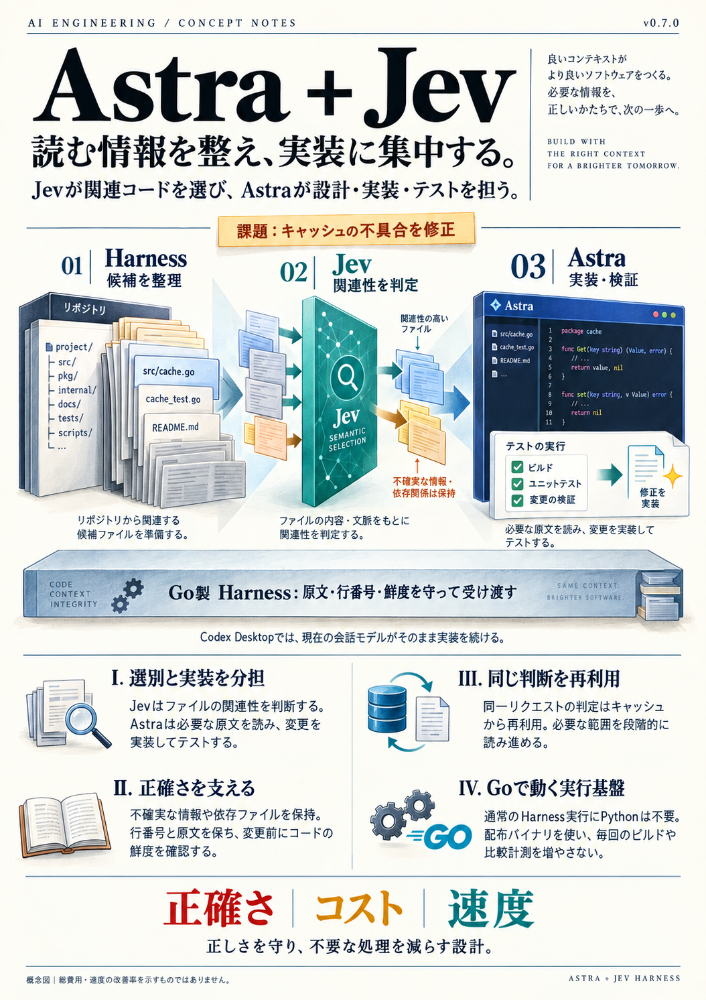
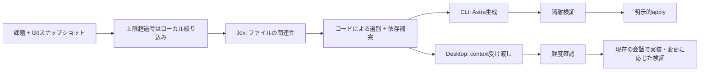

# Astra + Jev：Codex・Claude Code向けエージェントスキル

[English](README.md) · [バージョン 0.7.1](VERSION) · [タグ付きリリース](https://github.com/Oranquelui/astra-jev-harness/releases) · [変更履歴](CHANGELOG.md)

このリポジトリは、**Codex Desktop用の[`astra-jev-coding`エージェントスキル](Codex%20Desktop/skills/astra-jev-coding/SKILL.md)**と、別方式のCodex CLI用ハーネスを配布します。DesktopではJevが読むファイルを選び、現在の会話モデルが実装します。CLI版は別プロセスでCodexを実行します。別途、**Claude Code用の[`claude-jev-coding` Skill](Claude%20Code/skills/claude-jev-coding/SKILL.md)**を追加し、同じコンテキスト選別を現在のClaude Codeセッションで使えるようにしました。

**大きなrepoでは先に候補を絞り、Jevが候補を判断し、利用中のコーディングモデルがコードを書く。**



*v0.7.0で導入したGo実行版の構成は、v0.7.1でも共通です。Codex Desktopでの役割分担を示す概念図で、費用・速度の実測結果ではありません。*

Codex CLI・Codex Desktop・Claude Code向けのローカルCoding Harnessです。「公開APIを変えずにページングを修正して」といった課題から、対象ファイルをスナップショット化し、大きなrepoでは候補をローカルで絞ってからJevが関連性を判断します。依存ファイルを補い、何を残したか、その理由も記録します。

**目的：** コードの正しさを保ちながら、Astraの消費tokenと推論全体の費用を減らし、完成までの時間・手戻りも抑えることです。ファイル選別はそのための手段です。Claude Code版も同じ目的をClaudeに広げますが、その削減効果は未測定です。

**実験段階です。** 過去の**v0.3.0**で、**Astra Extra High（`xhigh`）**で合成CLI課題を修正・テストまで比較すると、**Astra入力27.0%減、Jev込みのStandard API単価換算27.2%減**でした。両方式とも同じ6件の確認に成功。所要時間はこの比較では7.3%減でしたが、別の`medium`比較では34.6%増でした。各方式1試行であり、一般的な高速化やDesktopでの効果は示しません。[測定条件と結果](docs/BENCHMARKS.md)。

## v0.7.1：Jev使用量の定型報告を削除

Desktop Skillが進捗・完了のたびにJevの呼び出し回数、token使用量、cache再利用件数、費用、出力bytesを報告する指示を削除しました。通常の返信は変更内容・検証結果・対応が必要な問題に絞ります。任意の進捗ログ選別と評価資料の再利用にあった個別の報告指示も整理しました。

呼び出し上限、cache検証、失敗時の復旧に必要な内部記録と、明示実行する`measure`コマンドは維持します。内訳はユーザーが明示的に依頼した場合だけ保存済み記録から回答し、報告のための追加API・ベンチマーク・比較は実行しません。今回はSkillの指示と配布versionの修正で、実行コードやプロバイダーの動作は変更していません。新たな速度・費用削減率も主張しません。

## v0.7.0：Pythonが不要なGo実行版

通常のHarness、両Skillの入口、installerを、ビルド済みの **`bin/astra-jev`** に移しました。Harnessを使うためのPythonは不要です。ソースからビルドする場合だけGoとCコンパイラを使い、配布archiveには実行ファイルとSkillを同梱します。対象プロジェクトのテストに必要な言語環境は別途必要です。

| 対象 | v0.6.0 | v0.7.0 |
|---|---|---|
| 起動・導入 | Pythonと各種スクリプト | 一度ビルド、または配布archiveから展開した実行ファイル |
| Desktop／Claude Code | Pythonのplan/select/check/read | 同じhost境界を守るGoのplan/select/check/read/present/discover/compare |
| CLI | Pythonの候補生成・適用 | Goの候補生成、再検証、明示apply、失敗時の復旧 |
| コンテキスト保護 | snapshot・hash・依存解析 | path／symlink／秘密情報の検査、鮮度確認、互換JSON／hash、呼び出し上限、cache検証 |
| 言語の依存解析 | PythonとJS／TS | Tree-sitterによるPython解析、既存JS／TS解決、Goのpackage／module依存 |
| 補助処理 | Pythonの資料・進捗ログ・使用量処理 | Goのevidence/output/measure。ログ対象コマンドは一度だけ実行 |
| 普段のCodingの負荷 | 比較コマンドは任意 | ベンチマーク、繰り返し計測、モデルA/B、自動ビルド、追加APIは導入しない |

正確さのため、Jevへの送信内容、cache key、不確実なファイルの保持、失敗処理を維持し、既存実装とローカルで照合します。Python構文の解析に不確実性があれば関連Pythonファイルを保持します。テスト・指示ファイルの保護、新規ファイルの明示許可、検証済み候補のhash照合、失敗時の復旧も維持します。費用・usageの欠測は不明のまま扱います。`measure`は明示実行時に保存記録を読む機能で、裏で常時計測しません。

今回の直接の改善は、Python環境の準備と毎回のインタープリタ起動が不要になることです。**Coding token、総費用、課題完了時間の削減率は今回実測していません。** 移植検証には一時repoとローカルの疑似プロバイダーを使い、実モデルの比較実行はしません。下記の過去ベンチマークは当時のversionの結果です。

ソースrepo内の`.py`実装とPython用の過去ベンチマークは、開発・互換性確認用として残します。ネイティブ配布archiveには含めず、通常コマンドとインストール済みSkillの`.sh`入口から実行しません。小さな`astra-jev-core`は独立したオフライン開発用ツールです。[移植範囲・互換性・ビルド](docs/GO-MIGRATION.md)。

## v0.6.0：原文の提示上限・段階的なファイル発見・使用量集計の改善


保持したcontextの読み方、最初の候補外にあるファイルの探し方、補助処理で使ったJevの使用量集計を改善しました。新しい`present`・`discover`はCodex DesktopとClaude Codeで使え、`measure.py`の改善はCLIの作業集計にも使えます。

[jevgrep](https://github.com/dzhng/jevgrep)の考え方を参考に、原文の提示上限を[`shared/context_view.py`](shared/context_view.py)、段階的な探索を[`shared/host_context.py`](shared/host_context.py)へ実装しました。[回帰テスト](tests/test_context_view.py)を伴うPythonコードの変更です。jevgrepのコードの複製・依存追加はしておらず、自動の意味探索や構文単位の選別は今後の検討対象です。[採用範囲](docs/JEVGREP-ADOPTION-PLAN.md)。

| 対象 | これまで | v0.6.0 |
|---|---|---|
| 保持ファイルの初回表示 | 選別後に個別の行範囲を読み、全文は`context.json`に保持 | `present`で読む順番、原文、hash、行番号、未提示範囲を指定した出力bytes内に表示 |
| 最初の候補外のファイル | 候補外のパスは記録するが、その後は手動で調査 | `discover`でディレクトリ一覧→短い原文preview→focus付き再計画へ進める |
| 進捗ログ選別の使用量 | `report.json`の`calls`を共通の計測処理が集計できなかった | 認識済みtool-output v1記録の既知usageをCLI・evidenceと統合し、欠測は不明のまま表示 |

### 必要候補を保持したまま、一度に読む量を制限

Jevの`select`と`check`が成功した後、最初のページを取得します。

```sh
python3 "Codex Desktop/skills/astra-jev-coding/scripts/context.py" present \
  --selection /absolute/selection --max-bytes 8192 --lines-per-file 12
```

上限はmetadata・末尾改行を含む**JSON応答全体**に適用します（1,024～24,000 bytes、既定8,192）。repo指示→focus→保存済み関連度の順に提示し、本文は確認済みsnapshotから複写します。Jevに原文や要約を生成させません。保持済み全文は残り、`unpresented_ranges`で未提示行、`next_offset`で次のファイルページを確認し、必要箇所は`read`で取得できます。収まらない長行は未提示を明示した読込先として返します。`present`は実APIまたはcacheによる有効なJev判定、鮮度、hostの一致を必須とし、追加APIを呼びません。

### 最初の候補外も段階的に探す

```sh
python3 "Codex Desktop/skills/astra-jev-coding/scripts/context.py" discover \
  --plan /absolute/plan
# 一覧に表示されたディレクトリを正確に指定:
python3 "Codex Desktop/skills/astra-jev-coding/scripts/context.py" discover \
  --plan /absolute/plan --directory src/another-component
```

ディレクトリとpreviewはページを辿って確認でき、複数の有力な枝を残します。ここで見えるファイルは**未判定**であり、「無関係」や「編集許可済み」ではありません。既存の`--focus-file`・`--include-file`を維持し、発見したfocusを加えた**新しいplan**を作り、送信候補と予算を確認して通常の`select → check`へ戻ります。自動追加APIや再試行は行わず、秘密情報・未対応ファイルの除外も維持します。操作型の探索であり、自動の意味検索や必要ファイルの発見保証ではありません。Claude Codeでは`Claude Code/context.py`と、そのhost専用のplan・selectionを使います。[使い方と制限](docs/CONTEXT-VIEWS.md)。

### コーディング周辺で使ったJevも集計

`measure.py`の`--candidate`または`--baseline`を繰り返し、関連するcoding/evidence記録とtool-outputの`report.json`を渡せます。記録形式を識別して、既知usage・記録済み時間・不明分を分けます。同一artifactパスは1回、同じrequest hashでも別の実呼び出しは別消費として数え、cacheの過去usageを新規消費へ加算しません。補助記録だけからラップしたcommandやDesktop会話全体の費用は確定しません。モデル別単価は任意の見積であり、実請求額とは区別します。[集計の詳細](docs/EVIDENCE.md#output-receipt-accounting-p1-a)。

### 確認できたこと・まだ測っていないこと

**オフライン199テストが成功**しました。出力bytes上限、Unicode/CRLF原文一致、長行、ページ網羅、探索後のfocus維持、古い／改変された成果物、別hostの誤受け渡し、Jev必須guard、usage・cacheの失敗系を確認しています。

実装時のJevは**12回試行・12回完了（入力83,571／出力813 token）、cache再利用0回**でした。37候補はすべて保持されました。その保存済み選別をローカルで歴史的に再生すると、**原文267,517 bytesの保持を維持**しながら、初回提示は7ファイル・**JSON全体5,750 bytes（原文3,459 bytes）**になりました。再生時の**追加APIは0回**です。これは選別と表示量の確認で、**Astra token、総費用削減、再読込、coding品質、完了時間の改善は未測定**です。以下に残したv0.3.0の過去ベンチマークを、v0.6.0の成果として扱いません。[実装・検証記録](docs/IMPROVEMENT-RESULTS-20260928.md)。

**v0.6.0当時の手順です。現行版は下記のv0.7.0導入手順を使います。** 既存cloneの変更を保持してそのtagへ更新し、`python3 install.py --check`（Claude Codeは`--target claude-code`を追加）でSkillの参照先を確認してください。既存のPython入口・保存記録・選別policy・方式分離は継続します。**v0.6.0にはPython 3.10以上が必要でした**で、[Python同梱配布案](docs/PYTHON-DISTRIBUTION-PROPOSAL.md)は今回未実装です。課題全体の共有予算、自動retry、構文単位の選別、batch/cacheの既定変更も含みません。

## v0.5.1：Desktop SkillでJev判定を必須化

`astra-jev-coding`を指定しても、`--mode local`でJev判定なしに選別が完了してしまう問題を修正しました。Skillの入口は`select`・`check`・`read`で有効なJev判定を確認します。localや小さい入力のautoによる省略はキー取得・API送信前に拒否し、過去のローカル選別結果も受け付けません。同一リクエストの判定再利用は維持し、新規API呼び出しと区別します。通常helperの明示的な比較モード、Claude Codeの既定動作、任意の進捗ログ選別は維持します。

検証は**オフライン183件成功**。インストール済みSkillから合成3ファイルのplan/select/check/readを通し、**Jev実API 1回（入力960・出力55 tokens）**で成功しました。同じ判定の再利用は**追加API 0回**でした。今回は実行の正しさを直した版で、**新たなToken・費用削減効果を主張するものではありません**。[更新の詳細](Codex%20Desktop/README.md) · [変更履歴](CHANGELOG.md)。

## v0.5.0：任意の進捗ログ選別

Desktop Skillにコマンドラッパーを追加しました。原文stdoutをGit外へ保存し、Jevが全文を確認した進捗チャンクだけを選別して、保持した原文と復元先を返します。診断・必須文字列・不確実/未判定部分を残し、失敗時は元の出力を返します。通常のCodex CLIセッションからも明示的に使えます。自動フック・履歴圧縮・モデル変更は行いません。

合成ログ1件では、返却stdoutが**19,885→7,601 bytes（61.8%減）**となり、省略マーカー・復元先を含めて**必須5項目すべてを保持**、原文の完全一致も確認しました。Jevは**2回、入力7,172／出力195 tokens**を使用。これは**AstraのToken・総費用・実装完了時間の削減測定ではありません**。[使い方と制限](docs/TOOL-OUTPUT.md)・[集計値](benchmarks/tool-output-smoke.json)。

### Codex CLIのモデル設定を継承

CLIハーネスはAstra・Mediumへの固定をやめ、設定された`model`と`model_reasoning_effort`を引き継ぎます。Desktop・Claude Codeハーネスは従来どおり現在の会話設定を使います。生成プロセスの隔離は維持し、モデル設定だけを渡します。未設定項目はCodexの既定を使います。独自プロバイダーとprofile選択は未対応です。指定値と確認できない応答モデルは分けて記録し、新しいtoken・費用削減は主張しません。[詳細と制限](Codex%20cli/README.md#モデル設定)。

## v0.4.0：Claude Code Skill

[`Claude Code/`](Claude%20Code/README-ja.md)に、`claude-jev-coding` Skillと小さなhelperを追加しました。helperはDesktopと同じホスト非依存の選別コア（`shared/host_context.py`）を使います。コードを書くのはClaude Codeで、Jevはファイルの関連性だけを判定します。helperがCodexやAstraを起動することはありません。成果物にはsurface `claude-code`が記録され、Desktop・CLIのhelperはこれを受け付けません。逆方向も同様に拒否します。これは移植であり、**Claude Codeでのtoken・費用削減は測定していません**。下記の過去のCodex測定結果は変更しておらず、Claude Codeでの削減効果を示すものではありません。

## v0.3.1：方式が分かるディレクトリ名

実装ディレクトリを[`Codex Desktop/`](Codex%20Desktop/README.md)と[`Codex cli/`](Codex%20cli/README.md)へ変更しました。シェルのコマンドでは空白を含むパスを引用符で囲みます。既存cloneの更新後に`python3 install.py`を再実行すると、このcloneを指す旧Desktop Skillリンクを移行します。他のSkillは保持します。rootの互換スクリプトとPython importは継続して使えます。今回の配布構成変更による新しいtoken・費用削減は主張しません。

## v0.3.0で何が改善したか

| 項目 | v0.2.0 | v0.3.0 |
|---|---|---|
| 22 KB超の適格ファイル | Jevで判定せず保持 | 全範囲を予算内で分割判定。不確実・判定漏れがあれば全文保持 |
| Desktopへの引き渡し | Skillが選択済み全文を読む | 本文を会話へ出す前に選別し、必要な行だけ読む |
| 小さいDesktop課題 | 判定可能なファイルがあれば`select`でJevを使う | 直接実行するhelperは`--mode auto`に対応。本文12,000 bytes未満なら全候補保持・Jev 0回。既定は`jev`。現在のDesktop SkillはJev判定を必須とする |
| 使用量・費用 | プロバイダー別token合計。費用見積なし | 通常入力・cache read/write・不明分を分離。任意のモデル別単価で見積 |

Codex Desktop Skillを更新し、全範囲判定と集計はCLIでも使えます。旧planの再現性は維持します。同じJevリクエストの応答再利用はv0.1.0からの機能であり、**v0.3.0で新たに得た節約効果には数えません**。[更新の詳細](docs/CONTEXT-BUDGETS.md) · [変更履歴](CHANGELOG.md)。

## 評価資料を使ったCoding（実験機能）

原文・行番号・出典hashを保ちながら評価資料を選別し、CLI/Desktopへ渡せます。失敗・予算の記録は明示的に固定し、同一Jevリクエストの再利用と保存runの使用量比較にも対応しました。[使い方と制限](docs/EVIDENCE.md)。

## CLI・Desktop・Claude Codeの違い

| | Codex CLI | Codex Desktop app | Claude Code |
|---|---|---|---|
| コードを書くモデル | 別プロセスのCodex CLI（設定済みモデル・推論強度） | 現在の会話モデル。Astra方式では会話側でAstraを選択 | 現在のClaude Codeセッション（モデル・effortはそのまま） |
| Jevの役割 | 生成前のコンテキスト選別 | 現在の会話が読むファイルの選別 | 現在のセッションが読むファイルの選別 |
| 手順 | `plan → run → verify → apply` | `plan → select → check → 会話で実装・変更に応じた検証` | Desktopと同じ |
| 対象への書き込み | 検証後の明示的な`apply` | Desktopの通常の編集ツール | Claude Codeの通常のツールと許可確認 |
| 入口 | `bin/astra-jev cli` | `bin/astra-jev desktop`またはSkill | `bin/astra-jev claude-code`または`/claude-jev-coding` |

DesktopとClaude Codeは、コード生成のために別のコーディングエージェントを起動しません。どの方式も、ホストのモデルメニューへJevを登録する機能ではありません。

## はじめに

必要なのはGit、OS／CPUに合うネイティブ実行ファイル、利用するホスト（CodexまたはClaude Code）です。配布archive利用時はPythonもGoも不要です。ソースからのビルドだけGo 1.26以上とTree-sitter用Cコンパイラが必要です。配布対象はmacOS arm64とLinux amd64で、それ以外は別途ビルド・検証してください。CLI生成には自分のCodexアカウントと動作する`codex sandbox`が必要で、フラグはCodexのversionに依存します。Jevへ送信する場合は自分のTypeSafe APIキーを使います。

```sh
git clone https://github.com/Oranquelui/astra-jev-harness.git
cd astra-jev-harness
scripts/build-native.sh
bin/astra-jev --help
```

**認証情報は利用者自身のものを使います。**

```sh
# 自分の環境で置き換えるか、secret managerから環境変数へ供給してください。
export TYPESAFE_API_KEY="YOUR_OWN_TYPESAFE_API_KEY"

# CLIで生成する場合だけ、必要に応じて自分のCodexアカウントへログイン。
codex login
bin/astra-jev cli doctor
```

作者のAPIキー、Codexログイン、Cookie、認証ファイルは配布物に含まれません。実キーをGitへ追加しないでください。`doctor`はキーの値を表示せず、外部APIも呼びません。環境変数を優先し、macOSでは設定済みのlogin Keychain（service `astra-jev-harness`、account `TYPESAFE_API_KEY`）も使用できます。installerはそのキーの作成や他人のアカウントの共有を行いません。

### Codex Desktopで使う

```sh
bin/astra-jev install --check
bin/astra-jev install
```

`$CODEX_HOME/skills`（既定`~/.codex/skills`）へDesktop用Skillの参照リンクだけを作成します。別のSkillの上書きは拒否し、モデル設定を変更したりログインを読み取ってコピーしたりしません。cloneしたディレクトリは残してください。アンインストール時はinstallerが作った`astra-jev-coding`のsymlinkだけを削除します。候補に反映されなければ新しいCodexタスクを開いてください。

対象リポジトリをDesktopで開き、依頼します。

```text
$astra-jev-coding この課題をAstra＋Jevで実装してください。対象は現在のcheckoutです。
```

Skillが課題・repo指示・送信対象を確認し、選別と鮮度確認を行った後、この会話で実装を続けます。Desktopプロセスからシェルの環境変数が見えない場合は、キー設定済みterminalでhelperを実行するか、任意のKeychain読み込みを使用してください。別terminalの`export`だけでは起動済みDesktopアプリの環境は変わりません。

Desktop Skillの呼び出しはJev選別を使う依頼として扱います。入口が`select`・`check`・`read`へ`--require-jev`を付けるため、通常は`--mode jev`で実行します。`local`と小さい入力の`auto`はキー取得・API呼び出し・出力作成の前に拒否し、Jev判定のない受け渡しも拒否します。有効な同一リクエストのキャッシュは利用できます。通常の返信は変更内容と検証結果に絞り、Jevの回数・使用量の内訳は明示的に依頼された場合だけ保存済み記録から回答します。キー不足やAPI失敗を理由にlocalへ黙って切り替えたり、記録を確認せず再実行したりしません。この確認はSkillの入口に適用され、会話中の全ツールを自動制御するものではありません。

開発ファイルの選別と、製品の実行時に有料モデルを呼ぶ処理は別の範囲です。ただし、すべての外部送信・有料呼び出しを禁じる指示は守ります。利用者がJevなしの比較・オフライン作業を明示的に求めた場合は、下記のhelperを直接使い、その方式を明記します。任意の`output.py`の動作は変わりません。[Desktopの詳細](Codex%20Desktop/README.md) · [v0.5.1の変更](CHANGELOG.md)。

### Claude Codeで使う

```sh
bin/astra-jev install --target claude-code --check
bin/astra-jev install --target claude-code
~/.claude/skills/claude-jev-coding/scripts/context.sh doctor
```

`~/.claude/skills`へ`claude-jev-coding`の参照リンクだけを作成します。プロジェクト単位で使う場合は`--skills-dir "/absolute/project/.claude/skills"`を指定します。上書き拒否・認証情報を扱わない点はDesktop版と同じで、何度実行しても結果は変わりません。`doctor`は`"surface": "claude-code"`とキーの有無を表示し、キーの値は表示しません。TypeSafeキーは自分のものを、環境変数または同じ任意のKeychain項目から使います。対象リポジトリでClaude CodeにJevで選別した変更を依頼するか、`/claude-jev-coding <課題>`で明示的に呼び出します。Skillはツールを事前承認せず、モデル・effortも変更せず、contextもforkしません。[Claude Codeの詳細](Claude%20Code/README-ja.md)。

2026-09-24にClaude Code 2.1.281で、Skillの検出・起動、plan/select/check/行範囲の読み取り、Claudeによる編集、テスト用コードの３件成功までローカルで確認しました。この確認は`--mode local`（Jev呼び出し０回）で行っており、Jev実接続やtoken削減のベンチマークではありません。当時のハーネス全体のオフラインテストは141件成功しました。

### CLI：自分のリポジトリで使う

課題を`/absolute/task.txt`へ書き、対象repo外の新しい保存先を指定します。`PLAN.md`を確認し、検証コマンドは対象プロジェクトに合わせます。

```sh
bin/astra-jev cli plan --repo /absolute/target/repo \
  --task-file /absolute/task.txt --out /absolute/plan
# この明示runでプロバイダーを呼びます。
bin/astra-jev cli run --plan /absolute/plan --out /absolute/run --mode jev \
  --verify-json '["go", "test", "./..."]'
# 保存された差分と検証結果を確認後に適用。
bin/astra-jev cli apply --run /absolute/run
```

`run`は隔離した候補を作り、`apply`は検証済みで変更されていない候補だけを適用します。commitはしません。`verify --run ...`はモデルを再度呼ばずに検証します。新規ファイルは`--allow-create`、既存テストの編集は`--allow-test-edit`をplanに明示します。[CLI詳細](docs/CLI.md)。

## 特徴

本文を会話へ読む前に選別し、`read --selection /absolute/selection --path src/main.py --start-line 1 --end-line 80`で必要行だけ取得できます。明示的に求められた方式比較では、helperの直接実行で`select --mode auto`を使えます。本文12,000 bytes未満ならJevを省略しますが、それ以上では呼び出す場合があります。オフライン・Jevなしの比較を求められた場合は、常に省略する`--mode local`を使います。既定は`jev`です。これらの省略はDesktop SkillでのJev利用の代わりにはなりません。cache read/writeの集計と任意単価での費用見積を追加しました。[動作・制限](docs/CONTEXT-BUDGETS.md)。

- **上限のある選別**：対象ファイルの全範囲を分割し、質問を含む予算内でバッチにまとめます。不確実な判断ではコンテキストを残し、解決できるPython/相対JavaScript依存、設定、repo指示を補います。
- **判定の可視化**：範囲ごとの確率・ファイルの保持理由・判定漏れ・本文バイト数を記録します。関連性は安全性の判定ではありません。
- **API再呼び出しなしの比較**：保存済み判断から方式を比較します。独立に特定した必要パスはplan内と`scoped_out`の両方を指定でき、ローカル絞り込みとJev選別の取りこぼしを分けて確認できます。ラベルがなければ保持率は不明です。
- **鮮度確認**：DesktopはHEAD・branch・status・本文・モードとplan/contextの整合を確認します。過去の結果の比較は古いcontextの利用許可ではありません。
- **適用範囲の制限**：CLIはCodexのread-only sandboxで候補を検証し、整合確認後、許可した編集を衝突検査・復旧記録付きで適用します。
- **失敗の記録**：サービスの自動再試行はありません。CLIは全候補を含むAstraプロンプトをシリアライズして500,000バイト上限をJev呼び出し前に確認します。Desktopは試行/完了を保存し、同一出力先の再利用を拒否します。応答のない試行も課金される可能性があります。

```sh
# 明示的に依頼されたauto方式の比較。Skillの入口ではなくhelperを直接実行します。
bin/astra-jev desktop plan --repo /absolute/repo \
  --task-file /absolute/task.txt --out /absolute/plan
bin/astra-jev desktop select --plan /absolute/plan \
  --out /absolute/selection --max-calls 4 --mode auto
bin/astra-jev desktop check --selection /absolute/selection
bin/astra-jev desktop compare --selection /absolute/selection \
  --required-file src/main.py
```

既定の`batch`は1件でも不確実ならバッチ全体を残します。実験用`select --policy per-file`は不確実/未判定を残しつつ、同バッチ内の明確に無関係なファイルを省きます。依存の補完と全件不一致時の全保持は維持します。変更前に比較し、バイト数の減少だけで正しさを判断しないでください。

## 大きなリポジトリ

適格ファイルが**2,000,000バイト・1,500ファイル・予定呼出数のいずれかの上限を超える**場合、`plan`はJevを呼ぶ前に、課題文とファイルの語の一致から候補を**ローカルで**絞ります。Desktopのplanは最大2,000,000バイト、CLIはAstraへ送るプロンプトの別上限500,000バイトに余地を残すため、絞り込み後の候補を350,000バイト以内に抑えます。すべての上限内なら全文候補を維持します。候補に残すファイルの本文を黙って切り詰めません。

課題に必要と分かっている適格ファイルは、繰り返し指定できる`--focus-file`で固定します。`--scope-max-calls`は候補全体の**計画上の**Jevリクエスト数の上限です（既定4回、範囲1〜24回）。後の`select --max-calls`による実行上限とは別です。未追跡ファイルは引き続き`--include-file`が必要です。`--focus-file`でも適格性や1ファイル100 KBの上限は迂回できません。

```sh
bin/astra-jev desktop plan --repo /absolute/repo \
  --task-file /absolute/task.txt --out /absolute/plan \
  --focus-file src/pagination.py --focus-file tests/test_pagination.py \
  --scope-max-calls 4
```

同じplan用の2つのフラグを`"Codex cli/main.py" plan`でも使えます。送信前に`PLAN.md`を確認してください。元の適格ファイル数/バイト数、絞り込み対象外のパス/バイト数、予定Jev呼び出し数を示します。`plan.json`の`scope`が集計、`scoped_out`が対象外の適格ファイルの情報です。**これらのファイルをJevは判定していません**。保護規則で除かれた`excluded`や、Jevが無関係と判定したファイルとも異なります。AGENTS.md・主要設定・解決できる依存は候補に残します。この語の一致は翻訳しないため、ASCIIのパスや識別子を含まない日本語だけの課題では`--focus-file`が必要になる場合があります。課題とファイルの一致がなく**必須パスの明示もない場合**、または必須ファイルが上限に収まらない場合はplanが停止するため、課題またはfocus pathを具体化してください。必要ファイルの保持率とAstraトークンへの効果は、独立した測定なしには分かりません。[設計とTypeSafe公式資料](docs/DESIGN.md)。

## トークン・費用はどれだけ減るか

**小さなCLI比較試験1件では、Astra入力tokenが27.0%、Jev込みのAPI単価換算費用が27.2%減りました。Codex DesktopやClaude Codeの課題全体での削減率は、まだ測定できていません。** CLIの数値はv0.3.0での結果であり、v0.5.1の新しい実績や、利用するProjectでの削減保証ではありません。

### 現在の版で確認できていること

v0.5.1では、Desktop Skillを指定すると有効なJev判定を必須とするよう実行経路を修正しました。同一リクエストの判定キャッシュも利用できます。インストール済みSkillの合成例は、**Jev実API 1回（入力960／出力55 token）**で成功し、同じ選別の再実行は判定を再利用して**追加API 0回**でした。これはJev連携と再利用の動作確認であり、Astraのtoken・費用削減測定ではありません。SkillはDesktop会話全体の使用量を取得できず、既に会話へ読み込んだ文脈も取り除けません。

| 方式 | 削減効果の測定状況 |
|---|---|
| Codex CLIハーネス | 下記の限定的な合成比較あり。現在のCLIは設定済みのモデル・推論強度を使うため、異なる設定には別の測定が必要です。 |
| Codex Desktop Skill | Astra会話全体のtoken・総費用・Codex契約枠の削減は**未測定**です。 |
| Claude Code Skill | セッション全体のtoken・総費用は**未測定**です。Astraの結果からClaude／Fableの削減率は判断できません。 |

### CLIの修正・検証まで：Astra単独とAstra＋Jev

両方式で同じv0.3.0ベースのコードとplan、**`gpt-6-astra`・Extra High（`xhigh`）**、入力に含めない同じ6件の動作確認を使い、各1回の生成で同じ修正を得ました。**合成1課題・各方式1試行**で、必要ファイルは明示固定し、候補本文の大半は無関係な園芸の文章でした。必要ファイルを見つける精度、代表的な開発作業、旧版からの改善率を測ったものではありません。

| 検証済み候補ができるまで（Extra High） | Astra単独 | Astra＋Jev | 観測差 |
|---|---:|---:|---:|
| Astra入力token | 19,198 | 14,011 | **27.0%減** |
| Astra出力token（reasoningを含む） | 193 | 126 | 今回は67減 |
| Astra生成回数 | 1回 | 1回 | 手戻り削減なし |
| Jev入力／出力token | 0 / 0 | 6,784 / 76 | 選別API 2回を追加 |
| 合計のStandard API単価換算 | $0.201630 | $0.146695 | **27.2%減** |
| 検証完了までの時間 | 12.78秒 | 11.85秒 | **今回の比較では7.3%減** |
| 動作確認の成功件数 | 6 / 6 | 6 / 6 | 同じ結果 |

同じ課題の**`medium`**比較では、Astra入力19,204→14,013（**27.0%減**）、API単価換算$0.195190→$0.143565（**26.4%減**）でしたが、時間は9.07→12.22秒（**34.6%増**）でした。こちらも同じ6件の確認に成功しています。さらに以前の**3課題**比較では、Astra入力は42,714→42,199で**1.2%減**にとどまり、時間は**16.3%増**、両方式とも22件すべて成功でした。一般的な削減率や安定した高速化は、まだ確認できていません。

費用は**2026-09-24**に記録した単価で換算し、Jevを含め、reasoningは出力tokenの内数として二重加算していません。v0.3.0の全4回の生成でcache read/writeは0と報告されており、キャッシュが効いた条件での削減は未検証です。**API単価換算であり、Codexの実請求額や契約枠の削減測定ではありません。** 実行順が固定、各1試行、実行時の警告もあるため、比較には制限があります。[方法・過去の結果](docs/BENCHMARKS.md) · [Extra High集計](benchmarks/cli-coding-xhigh-v0.3.0.json) · [Medium集計](benchmarks/cli-coding-v0.3.0.json) · [3課題集計](benchmarks/results-2026-09-22.json)。

### 本文を減らすことと、token・費用を減らすことは別の測定です

| 別途行った動作確認 | 観測結果 | 未測定のもの |
|---|---|---|
| v0.2.0 → v0.3.0、同じ2ファイルの選別 | 保持本文**27,353→75 bytes（99.73%減）**。Jevは**1→2回**、費用見積は**$0.000016464→$0.000284928** | Astra tokenと課題全体の費用。Jev費用は**$0.000268464増**です。 |
| v0.5.0、合成した進捗ログ1件 | 返却stdoutは省略マーカー・復元先込みで**19,885→7,601 bytes（61.8%減）**。**必須5項目すべて保持**。Jevは**2回、入力7,172／出力195 token** | Astra token、総費用、実装完了までの時間。 |

前者は未判定だった大きなファイルを判定して除外できるか、後者は任意の出力ラッパーの動作を確認したものです。どちらの割合もモデルのtoken削減率ではありません。保守的な選別では全候補を残す場合もあり、**本文削減0%でもJevの使用量は発生します**。ローカルでの候補絞り込み、Jev判定、キャッシュ再利用の効果は分けて扱います。[ファイル選別の集計](benchmarks/context-selection-v0.3.0.json) · [出力ラッパーの集計](benchmarks/tool-output-smoke.json)。

### 自分の作業で効果を判断するには

差し引きの費用削減は、全試行を含む**Jevなしの総費用 −（Jevありのコーディングモデル費用 ＋ Jev費用）**です。通常入力、cache read/write、出力を分けて計算し、異なるプロバイダーのtokenを足して価格として扱わないでください。入力の変更はキャッシュにも影響し、失敗した呼び出し・再読込・手戻りで節約分がなくなる場合があります。

次の評価では、代表的な実課題を**通常のCodex／ローカルでの候補絞り込みのみ／ローカル絞り込み＋Jev**で繰り返し比較する必要があります。モデル・推論強度、ソースの版、完了条件を揃え、キャッシュなし／ありを分け、選別待ち・再読込・再試行も完了まで集計します。目標は一定割合の保証ではなく、**正しさと完成までの時間を損なわずにtokenと総費用を減らすこと**です。[計測機能と制限](docs/CONTEXT-BUDGETS.md)。

## 仕組み


```mermaid
flowchart LR
  T[課題 + Gitスナップショット] --> S[上限超過時はローカル絞り込み]
  S --> J[Jev: ファイルの関連性]
  J --> P[コードによる選別 + 依存補完]
  P --> C[CLI: Astra生成]
  C --> V[隔離検証]
  V --> A[明示的apply]
  P --> D[Desktop: context受け渡し]
  D --> F[鮮度確認]
  F --> E[現在の会話で実装・変更に応じた検証]
```

`shared/`はTypeSafe通信・snapshot・選別・資格情報の取得、`Codex cli/`は生成・候補検証・適用、`shared/host_context.py`はホスト非依存のcontext受け渡し、`Codex Desktop/`と`Claude Code/`は薄いホスト用adapterとSkillを担当します。rootスクリプトは互換入口です。JevはNoulのyes/no形式で関連性を判断し、コードは生成しません。回数・パス等の制約はコードが管理します。

## 外部へ送信される情報

`plan`・`check`・`read`・`compare`はローカル処理です。Jevを使う場合、`select`は課題・相対パス・対象ソース本文をTypeSafeへ送り、ローカルで`scoped_out`になったファイルの本文はJevへ送りません。CLI生成は選別したcontextに加え、対象外ファイルの**名前**を最大512件と総件数を自分のログインでCodexへ送ります。Astraが不足を示した場合に新しいplanを作れるようにするためです。HarnessはAstra子プロセスの環境から`TYPESAFE_API_KEY`・`OPENAI_API_KEY`・`CODEX_API_KEY`を除外し、Codexログインを配布物へ書き出しません。

plan・candidate・runにはソースが入ります。対象repo外に保存し、Gitへ追加しないでください。収集時に既知の秘密情報パターンや対象外形式を除きますが、完全な検出器ではありません。私有コードを送信する前に`PLAN.md`を確認してください。[資格情報の扱い](SECURITY.md)。

## 現在の制限

- Git追跡済みと明示指定した未追跡のUTF-8ファイル。絞り込み後のplanは最大2 MB・1,500ファイル・1ファイル100 KB。元の適格ファイルが2 MB・1,500ファイル・予定呼出数のいずれかの上限を超えると課題に基づくローカル絞り込みが入り、CLIの候補バイト上限は350,000です。確認した未追跡ファイルは`plan --include-file`で追加でき、stageは不要です。
- 新規planは22 KB超も全範囲を分割して判定します。不確実・未判定範囲があれば全文を保持し、旧planは従来方式を再現します。[予算と計測](docs/CONTEXT-BUDGETS.md)。
- 通常のPython `src`配置、ローカルTS alias・JSONC継承、`.mts`等を補完します。動的importや任意のビルド設定の解決は部分的です。
- CLI検証は依存をインストールしません。成果物を書き込むビルドはread-only検証で動かない場合があります。指定テストの成功は全体の正しさの証明ではありません。
- Desktopには自動モデル切替・会話圧縮・会話全体のトークン計測はありません。選択済みの会話モデルを使用します。
- Claude Code Skillにはhook・MCPサーバー・会話圧縮・モデル/effortの変更はなく、Claude Codeの使用量も計測しません。token・費用への効果は未測定です。
- 0.2/0.8の閾値は実験値であり、利用者のrepoの精度を保証しません。

## 関連プロジェクト

| プロジェクト | 主な役割 | この実装との関係 |
|---|---|---|
| [hermes-jev-skills](https://github.com/kerpopule/hermes-jev-skills) | モデル切替、検索、Skill選択などのJev判断 | 判定/未判定の区別と、評価してから方式を変える方針を参考にした |
| [jev-lint](https://github.com/mizchi/jev-lint) | 対象コードへの意味的なlint質問 | READMEの具体例、導入、実測、制限の書き方を参考にした。依存として同梱していない |
| 本プロジェクト | Codex CLI・Codex Desktop・Claude Code向けファイル選別 | CLIは生成・検証・適用。DesktopとClaude Codeは現在の会話が実装 |

同条件の性能比較ではありません。参考先のinstaller・plugin・ソースコードは同梱していません。[設計メモ](docs/DESIGN.md)。

## ライセンス

[MIT](LICENSE)。OpenAIやTypeSafeの公式製品ではありません。利用するプロバイダーのアクセス権と支払いは利用者自身が管理します。
