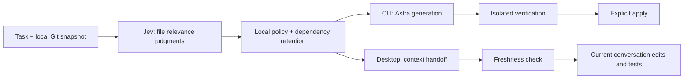

# Astra + Jev Coding Harness

[日本語](README-ja.md) · [Release v0.1.0](https://github.com/Oranquelui/astra-jev-harness/releases/tag/v0.1.0) · [Changelog](CHANGELOG.md)

Let **Jev decide which files matter**, then let **Astra write the code**.

A local coding harness for Codex CLI and Codex Desktop. Give it a task such as “fix pagination without changing the public API”; it snapshots eligible files, asks Jev which ones the coding model needs, preserves dependencies, and records what was kept and why.

**Experimental.** In a three-task synthetic comparison, candidate files fell **85.7%**, but Astra-reported input tokens fell only **1.2%** and elapsed time increased. Smaller file context is not the same as a cheaper agent session. [See the measurements](docs/BENCHMARKS.md).

## Evidence-aware coding (experimental)

Select original evaluation excerpts with source hashes and line numbers, retain pinned failure/budget records, reuse identical Jev requests, and compare saved run usage. Both CLI and Desktop accept the resulting evidence packet. [Commands and limits](docs/EVIDENCE.md).

## Pick your workflow

| | Codex CLI | Codex Desktop app |
|---|---|---|
| Who writes code? | A separate Codex CLI process using Astra | The model in your current conversation; select Astra for the Astra workflow |
| What does Jev do? | Selects context before generation | Selects files for the current conversation to read |
| Workflow | `plan → run → verify → apply` | `plan → select → check → implement/test in the conversation` |
| Target writes | Explicit `apply` after verification | Your normal Desktop editing tools |
| Entrypoint | `python3 cli/main.py` | `python3 desktop/context.py` or the Skill |

Desktop does **not** spawn another Codex CLI to generate code. Neither workflow registers Jev as a model in Codex's Model menu.

## Start here

Requires Python **3.10+**, Git, your own TypeSafe API key, and Codex. No third-party Python runtime dependencies. Tested locally on macOS with Python 3.14 and Codex CLI 0.153.2; other platforms and Codex versions are not established by that measurement. CLI generation requires access to `gpt-6-astra` in your own Codex account and a working `codex sandbox` command. The included runtime flags are version-sensitive.

```sh
git clone https://github.com/Oranquelui/astra-jev-harness.git
cd astra-jev-harness
python3 -m unittest -v
```

Use **your own credentials**:

```sh
# Replace the placeholder locally, or supply it through your secret manager.
export TYPESAFE_API_KEY="YOUR_OWN_TYPESAFE_API_KEY"

# CLI generation only: log in to your own account if needed.
codex login
python3 cli/main.py doctor
```

No maintainer API key, Codex login, session cookie, or authentication file is included. Never commit a real key. `doctor` reports availability, not the value; it does not call an API. Existing environment values take precedence. On macOS, an already-configured login Keychain item with service `astra-jev-harness` and account `TYPESAFE_API_KEY` can be used instead. The installer does not create that item or share anyone else's account.

### Codex Desktop

```sh
python3 install.py --check
python3 install.py
```

This links only the Desktop Skill into `$CODEX_HOME/skills` (default `~/.codex/skills`). It refuses to overwrite a different existing Skill, changes no Codex model settings, and does not read or copy your login. Keep this clone in place. To uninstall, remove only the `astra-jev-coding` symlink created by the installer. If it is not visible yet, start a new Codex task.

Open the target repository in Codex Desktop and ask:

```text
$astra-jev-coding Fix this task with Astra + Jev in the current checkout.
```

The Skill uses your task and repository instructions, reviews the files to send, selects context, checks freshness, and continues implementation in that conversation. If the Desktop process cannot see your shell environment, use the helper from a terminal with the key configured or the optional Keychain lookup; `export` in a separate terminal does not change an already-running app's environment.

### CLI: an isolated example

Run these from the clone root. Plan and run directories must be outside the target repository and must not already exist.

```sh
DEMO_ROOT=$(mktemp -d)
python3 make_demo.py "$DEMO_ROOT/repo"
printf '%s\n' 'Fix page_items: page numbers start at 1. Clamp page and explicit size to at least 1; use DEFAULT_PAGE_SIZE only when size is None. Preserve the API and tests.' > "$DEMO_ROOT/task.txt"

# Local inspection only. Review PLAN.md before sending source to a provider.
python3 cli/main.py plan --repo "$DEMO_ROOT/repo" \
  --task-file "$DEMO_ROOT/task.txt" --out "$DEMO_ROOT/plan"

# Paid/provider usage: at most 24 Jev requests and 2 Astra generations.
python3 cli/main.py run --plan "$DEMO_ROOT/plan" \
  --out "$DEMO_ROOT/run" --mode jev \
  --verify-json '["python3", "-B", "-m", "unittest", "discover"]'

# Review REPORT.md, changes.diff, and verification output first.
python3 cli/main.py apply --run "$DEMO_ROOT/run"
```

`run` writes a candidate outside the target. `apply` accepts only verified, unchanged artifacts and leaves changes uncommitted. `verify --run ...` reruns verification without another model call. New files and existing test edits require explicit plan flags: `--allow-create path` and `--allow-test-edit path`. [CLI details](docs/CLI.md).

## What it does

- **Bounded selection.** Full eligible file contents are grouped into requests. Uncertain judgments preserve context. Resolvable Python/relative JavaScript dependencies, configuration, and repository instructions are retained.
- **Visible decisions.** Per-file probabilities, retention reasons, unjudged files, and before/after source bytes are recorded. Relevance is not a security verdict.
- **Local policy comparison.** Replay saved judgments with no API call. Supply independently identified required files to see omissions; without labels, recall is unknown.
- **Freshness checks.** Desktop checks the plan and selected content against repository HEAD, branch, status, file contents, and modes. A historical comparison does not authorize using stale context.
- **Scoped edits.** CLI verifies a candidate in Codex's read-only sandbox, checks its integrity, then applies permitted edits with collision checks and recovery records.
- **Explicit failures.** No automatic service retries. Desktop records attempted and completed requests and refuses to reuse an output directory. Failed requests may still be billable.

```sh
python3 desktop/context.py plan --repo /absolute/repo \
  --task-file /absolute/task.txt --out /absolute/plan
python3 desktop/context.py select --plan /absolute/plan \
  --out /absolute/selection --max-calls 4
python3 desktop/context.py check --selection /absolute/selection
python3 desktop/context.py compare --selection /absolute/selection \
  --required-file src/main.py
```

The default `batch` policy retains an entire batch when any judgment is uncertain. The experimental `select --policy per-file` retains uncertain/unjudged files while omitting confidently irrelevant siblings. Dependencies and the global no-match fallback still apply. Compare before changing policy; fewer bytes alone do not establish correctness.

## How much does it save?

Historical controlled rerun: three small synthetic Python tasks, one trial per task and mode. Same Astra model and reasoning setting; 22 behavior checks passed in each arm.

| Metric, three tasks combined | Astra only | Astra + Jev | Observed change |
|---|---:|---:|---:|
| Candidate files sent to Astra | 28 | 4 | **85.7% fewer** |
| Harness-written prompt characters | 4,309 | 2,581 | **40.1% fewer** |
| Astra-reported input tokens | 42,714 | 42,199 | **1.2% fewer** |
| Astra-reported output tokens | 175 | 175 | Unchanged |
| Elapsed time | 18.51 s | 21.53 s | **16.3% longer** |
| Jev input tokens | — | 4,094 | Separate provider usage |

These are historical measurements, **not a benchmark of every feature in this release**. Dollar savings, Codex weekly-limit consumption, and end-to-end Desktop token savings were not measured. Do not add different providers' tokens together to infer price. The context-selection layer cannot remove Codex's shared instructions, tools, or existing conversation history. [Method, caveats, later selection results, and reproduction](docs/BENCHMARKS.md) · [Aggregate data](benchmarks/results-2026-09-22.json).

## How it works



`shared/` owns TypeSafe transport, snapshots, selection, and credential lookup. `cli/` owns generation, candidate verification, and apply. `desktop/` owns the context handoff and Skill. Root scripts remain compatibility entrypoints. Jev answers Noul yes/no relevance questions; it does not generate code. Code enforces limits and paths.

## What leaves your machine

`plan`, `check`, and `compare` are local. `select` sends the task, relative paths, and eligible source contents to TypeSafe. CLI generation sends selected context to Codex using your own login; the harness removes `TYPESAFE_API_KEY`, `OPENAI_API_KEY`, and `CODEX_API_KEY` from the Astra child environment. It does not export or package your Codex login.

Plans, candidates, and run files contain source text. Store them outside the target repository and keep them out of Git. The source filter rejects known credential patterns and excluded file types; it is not a complete secret detector. Review `PLAN.md` before sending private code. [Security and credential handling](SECURITY.md).

## Current limits

- Tracked eligible UTF-8 files plus explicitly included untracked files: up to 2 MB total, 1,500 files, and 100 KB per file. Use reviewed `plan --include-file` paths; no staging is required.
- Files over the 22 KB batch allowance are retained without inference. All-unjudged selection can mean zero Jev calls.
- Dependency discovery is partial. Conventional Python `src` roots, local TS aliases and `.mts` are supported; dynamic imports and arbitrary build configurations remain partial.
- CLI verification does not install dependencies; read-only verification may not support builds that write artifacts. Passing supplied tests is not proof of complete correctness.
- Desktop has no automatic model routing, conversation compaction, or total-session token meter. The current model remains the model you selected.
- Experimental thresholds (0.2/0.8) are not calibrated guarantees for your repository.

## Related projects

| Project | Main job | Relationship |
|---|---|---|
| [hermes-jev-skills](https://github.com/kerpopule/hermes-jev-skills) | Jev-based agent decisions including routing, retrieval, and skill selection | Informed our explicit judgment coverage and evaluation-first policy comparison |
| [jev-lint](https://github.com/mizchi/jev-lint) | Semantic lint questions over matched code | Informed the README's concrete examples, setup, measured results, and limitations; not bundled |
| This project | File-context selection for two Codex coding workflows | Generation/verification/apply in CLI; native conversation implementation in Desktop |

This is not a head-to-head performance comparison. No installer, plugin, or source code from those repositories is bundled. [Design notes](docs/DESIGN.md).

## License

[MIT](LICENSE). Independent project; not affiliated with OpenAI or TypeSafe. Provider access and billing remain each user's responsibility.
