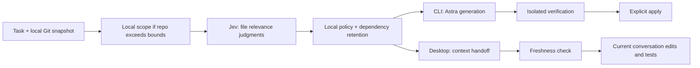

# Astra + Jev: Codex and Claude Code Agent Skills

[日本語](README-ja.md) · [Version 0.5.1](VERSION) · [Tagged releases](https://github.com/Oranquelui/astra-jev-harness/releases) · [Changelog](CHANGELOG.md)

This repository provides the **[`astra-jev-coding` Codex Agent Skill](Codex%20Desktop/skills/astra-jev-coding/SKILL.md) for Codex Desktop** and a separate harness for Codex CLI. Install the Skill to use Jev for context selection while the current Desktop conversation implements the task; the CLI workflow runs Codex separately. A separate **[`claude-jev-coding` Skill](Claude%20Code/skills/claude-jev-coding/SKILL.md) for Claude Code** applies the same context selection to the current Claude Code session.

Narrow large repositories locally, let **Jev judge the bounded candidates**, then let **your coding model write the code**.

A local coding harness for Codex CLI, Codex Desktop and Claude Code. Give it a task such as “fix pagination without changing the public API”; it snapshots eligible files, locally narrows oversized repositories, asks Jev which candidates the coding model needs, preserves dependencies, and records what was kept and why.

**Goal:** reduce Astra token consumption and combined inference cost while preserving coding correctness and avoiding extra turnaround time. File selection is a means to that goal. The Claude Code Skill extends the same goal to Claude; its savings are not yet measured.

**Experimental.** In a historical **v0.3.0** comparison, one synthetic CLI coding task at **Astra Extra High (`xhigh`)** used **27.0% fewer Astra input tokens** and **27.2% less at equivalent Standard API rates**, including Jev. Both modes passed the same six checks. Elapsed time was 7.3% shorter in this pair, but 34.6% longer in a separate `medium` pair. Each is one trial per mode, not a general speedup or Desktop result. [Measurements and limits](docs/BENCHMARKS.md).

## v0.5.1: require Jev judgments in the Desktop Skill

Fix a workflow where invoking `astra-jev-coding` could still finish context selection with `--mode local` and no Jev judgment. The Skill entrypoint now requires validated Jev judgments for `select`, `check`, and `read`. Local or small-context auto skips fail before credentials or transmission; previously saved local handoffs are also rejected. Matching cached judgments remain valid and are reported separately from new API calls. Direct native helpers retain explicit baseline modes; Claude Code defaults and optional progress-log selection are unchanged.

Validation: **183 offline tests passed**. An installed-Skill check on a synthetic three-file repository completed plan/select/check/read with **one Jev call (960 input / 55 output tokens)**; reusing the same judgments required **zero additional API calls**. This release fixes execution correctness and makes **no new token or cost-saving claim**. [Upgrade details](Codex%20Desktop/README.md) · [Changelog](CHANGELOG.md).

## v0.5.0: optional progress-log selection

The Desktop Skill now includes an explicit command wrapper: archive original stdout outside Git, ask Jev about fully visible progress chunks, and return verbatim retained lines with a recovery path. Diagnostics, required literals and uncertain/unjudged chunks stay; failures restore the original output. Normal Codex CLI sessions can invoke the same wrapper. It does not automatically intercept tools, compact history, or change the coding model.

One synthetic log check reduced returned stdout from **19,885 to 7,601 bytes (61.8%)**, including omission markers and the archive footer, while retaining **5/5 required facts** and a byte-exact original. Jev made **2 calls: 7,172 input / 195 output tokens**. This is **not an Astra token, cost or completed-coding-task speedup measurement**. [Usage and boundaries](docs/TOOL-OUTPUT.md) · [Measured aggregate](benchmarks/tool-output-smoke.json).

### Codex CLI model settings

The CLI harness now forwards the configured `model` and `model_reasoning_effort`, rather than forcing Astra/Medium. Desktop and Claude Code harnesses continue using their active sessions. Only model settings are forwarded; generation isolation remains. Missing settings use Codex defaults. Custom providers and profile selection are not supported. Requested settings are recorded separately from unknown serving-model identity; no new token or cost saving is claimed. [Details and limits](docs/CLI.md#model-verification-and-limits).

## v0.4.0: Claude Code Skill

[`Claude Code/`](Claude%20Code/README.md) adds a `claude-jev-coding` Skill and a thin helper over the same host-neutral selection core as Desktop (`shared/host_context.py`). Claude Code writes the code; Jev only judges file relevance. The helper never starts Codex or Astra. Its artifacts record surface `claude-code` and are rejected by the Desktop and CLI helpers, and the reverse also holds. This is an adaptation, **not a measured Claude Code token or cost reduction**. The historical Codex measurements below are unchanged and do not establish Claude Code savings.

## v0.3.1: explicit workflow directories

The implementation directories are now [`Codex Desktop/`](Codex%20Desktop/README.md) and [`Codex cli/`](Codex%20cli/README.md). Quote paths with spaces in shell commands. After updating an existing clone, rerun `python3 install.py` to migrate this clone's old Desktop Skill symlink. Other installed Skills are preserved. Root compatibility scripts and Python imports remain available. This packaging update makes no new token or cost claim.

## What improved in v0.3.0?

| Area | v0.2.0 | v0.3.0 |
|---|---|---|
| Eligible files larger than 22 KB | Retained without a Jev judgment | Every range is judged within a request budget; uncertainty or missing coverage retains the whole file |
| Desktop handoff | Skill reads the full selected context | Skill selects before loading implementation bodies, then reads needed line ranges |
| Small Desktop tasks | `select` always uses Jev when there are judgeable files | Native helper supports `--mode auto`: below 12,000 source bytes, retain candidates with zero Jev calls; command default remains `jev`. The current Desktop Skill requires Jev judgments |
| Usage and cost | Provider token totals; no price estimate | Separate ordinary input, cache reads/writes and unknowns; optional exact-model price estimates |

These changes apply to the Codex Desktop Skill; complete-range selection and accounting also support CLI. Existing plans keep their replay behavior. Exact-request Jev response reuse already existed in v0.1.0 and is **not a new v0.3.0 saving**. [Upgrade details](docs/CONTEXT-BUDGETS.md) · [Changelog](CHANGELOG.md).

## Evidence-aware coding (experimental)

Select original evaluation excerpts with source hashes and line numbers, retain pinned failure/budget records, reuse identical Jev requests, and compare saved run usage. Both CLI and Desktop accept the resulting evidence packet. [Commands and limits](docs/EVIDENCE.md).

## Pick your workflow

| | Codex CLI | Codex Desktop app | Claude Code |
|---|---|---|---|
| Who writes code? | A separate Codex CLI process using its configured model and reasoning effort | The model in your current conversation; select Astra for the Astra workflow | The current Claude Code session, with its own model and effort |
| What does Jev do? | Selects context before generation | Selects files for the current conversation to read | Selects files for the current session to read |
| Workflow | `plan → run → verify → apply` | `plan → select → check → implement/validate as appropriate in the conversation` | Same as Desktop |
| Target writes | Explicit `apply` after verification | Your normal Desktop editing tools | Claude Code's normal tools and permission prompts |
| Entrypoint | `python3 "Codex cli/main.py"` | `python3 "Codex Desktop/context.py"` or the Skill | `python3 "Claude Code/context.py"` or `/claude-jev-coding` |

Desktop and Claude Code do **not** spawn another coding agent to generate code. No workflow registers Jev as a model in a host's model menu.

## Start here

Requires Python **3.10+**, Git, and the host you use: Codex for the Codex workflows, or Claude Code for the Claude Skill. Live Jev selection requires your own TypeSafe API key; local selection does not. No third-party Python runtime dependencies. Codex measurements were made locally on macOS with Python 3.14 and Codex CLI 0.153.2; other platforms and Codex versions are not established by that measurement. CLI generation requires access to the configured model in your own Codex account and a working `codex sandbox` command. The included runtime flags are version-sensitive.

```sh
git clone https://github.com/Oranquelui/astra-jev-harness.git
cd astra-jev-harness
python3 -m unittest -v
```

Use **your own credentials**:

```sh
# Replace the placeholder locally, or supply it through your secret manager.
export TYPESAFE_API_KEY="YOUR_OWN_TYPESAFE_API_KEY"

# CLI generation only: log in to your own account if needed.
codex login
python3 "Codex cli/main.py" doctor
```

No maintainer API key, Codex login, session cookie, or authentication file is included. Never commit a real key. `doctor` reports availability, not the value; it does not call an API. Existing environment values take precedence. On macOS, an already-configured login Keychain item with service `astra-jev-harness` and account `TYPESAFE_API_KEY` can be used instead. The installer does not create that item or share anyone else's account.

### Codex Desktop

```sh
python3 install.py --check
python3 install.py
```

This links only the Desktop Skill into `$CODEX_HOME/skills` (default `~/.codex/skills`). It refuses to overwrite a different existing Skill, changes no Codex model settings, and does not read or copy your login. Keep this clone in place. To uninstall, remove only the `astra-jev-coding` symlink created by the installer. If it is not visible yet, start a new Codex task.

Open the target repository in Codex Desktop and ask:

```text
$astra-jev-coding Fix this task with Astra + Jev in the current checkout.
```

The Skill uses your task and repository instructions, reviews the files to send, selects context, checks freshness, and continues implementation in that conversation. If the Desktop process cannot see your shell environment, use the helper from a terminal with the key configured or the optional Keychain lookup; `export` in a separate terminal does not change an already-running app's environment.

Invoking the Desktop Skill requests Jev selection. Its launcher enforces `--require-jev` on `select`, `check`, and `read`; use `--mode jev`. It rejects `local` and small-context `auto` before credentials, API calls, or output creation, and refuses handoffs without valid Jev judgments. Matching cached judgments remain usable; report reused judgments separately from new API calls. A missing key or provider failure must not silently switch the workflow to local selection or trigger a blind retry. These checks apply to this Skill's entrypoint, not every tool in the conversation.

Development selection and the product runtime's paid-model calls have separate scopes; an explicit ban on all external or paid calls still applies. For a user-requested no-Jev baseline/offline run, use the direct native helper described below and label it as such. The optional `output.py` behavior is unchanged. [Desktop details](Codex%20Desktop/README.md) · [v0.5.1 changes](CHANGELOG.md).

### Claude Code

```sh
python3 install.py --target claude-code --check
python3 install.py --target claude-code
python3 ~/.claude/skills/claude-jev-coding/scripts/context.py doctor
```

This links only `claude-jev-coding` into `~/.claude/skills`. For project scope, add `--skills-dir "/absolute/project/.claude/skills"`. The installer applies the same no-overwrite and no-credential rules as the Desktop install and is idempotent. `doctor` reports `"surface": "claude-code"` and key availability without printing the key. Use your own TypeSafe key, from the environment or the same optional Keychain item. In the target repository, ask Claude Code for a Jev-selected change, or invoke the Skill explicitly with `/claude-jev-coding <task>`. The Skill does not pre-approve tools, change the model or effort, or fork context. [Claude Code details](Claude%20Code/README.md).

Locally verified on 2026-09-24 with Claude Code 2.1.281: Skill discovery and invocation, then plan/select/check/bounded read, native editing and three passing fixture tests. This acceptance check used `--mode local` (zero Jev calls); it is not a live-Jev or token-savings benchmark. The full offline harness suite passed 141 tests at that stage.

### CLI: an isolated example

Run these from the clone root. Plan and run directories must be outside the target repository and must not already exist.

```sh
DEMO_ROOT=$(mktemp -d)
python3 make_demo.py "$DEMO_ROOT/repo"
printf '%s\n' 'Fix page_items: page numbers start at 1. Clamp page and explicit size to at least 1; use DEFAULT_PAGE_SIZE only when size is None. Preserve the API and tests.' > "$DEMO_ROOT/task.txt"

# Local inspection only. Review PLAN.md before sending source to a provider.
python3 "Codex cli/main.py" plan --repo "$DEMO_ROOT/repo" \
  --task-file "$DEMO_ROOT/task.txt" --out "$DEMO_ROOT/plan"

# Paid/provider usage: at most 24 Jev requests and 2 Astra generations.
python3 "Codex cli/main.py" run --plan "$DEMO_ROOT/plan" \
  --out "$DEMO_ROOT/run" --mode jev \
  --verify-json '["python3", "-B", "-m", "unittest", "discover"]'

# Review REPORT.md, changes.diff, and verification output first.
python3 "Codex cli/main.py" apply --run "$DEMO_ROOT/run"
```

`run` writes a candidate outside the target. `apply` accepts only verified, unchanged artifacts and leaves changes uncommitted. `verify --run ...` reruns verification without another model call. New files and existing test edits require explicit plan flags: `--allow-create path` and `--allow-test-edit path`. [CLI details](docs/CLI.md).

## What it does

Select before loading bodies into the conversation, then use `read --selection /absolute/selection --path src/main.py --start-line 1 --end-line 80` for needed ranges. For explicitly requested mode comparisons, the direct native helper retains `select --mode auto`: it skips Jev under 12,000 source bytes but may call Jev for larger inputs. Use `--mode local` for an explicitly requested offline/no-Jev baseline; default remains `jev`. These bypass modes are not a substitute for the Desktop Skill's Jev workflow. Measurement separates cache reads/writes and supports supplied model-specific price estimates. [Behavior and limits](docs/CONTEXT-BUDGETS.md).

- **Bounded selection.** Complete eligible sources are split into bounded ranges and grouped with their questions into requests. Uncertain judgments preserve context. Resolvable Python/relative JavaScript dependencies, configuration, and repository instructions are retained.
- **Visible decisions.** Source-range probabilities, per-file retention reasons, incomplete judgments, and before/after source bytes are recorded. Relevance is not a security verdict.
- **Local policy comparison.** Replay saved judgments with no API call. Independently identified required-file labels can include paths in the plan or `scoped_out`, exposing local-scope misses separately from Jev-selection misses; without labels, recall is unknown.
- **Freshness checks.** Desktop checks the plan and selected content against repository HEAD, branch, status, file contents, and modes. A historical comparison does not authorize using stale context.
- **Scoped edits.** CLI verifies a candidate in Codex's read-only sandbox, checks its integrity, then applies permitted edits with collision checks and recovery records.
- **Explicit failures.** No automatic service retries. CLI checks the serialized worst-case Astra prompt against its 500,000-byte limit before any Jev call. Desktop records attempted and completed requests and refuses to reuse an output directory. Failed requests may still be billable.

```sh
# Direct helper: an explicitly requested auto-mode comparison, not the Skill entrypoint.
python3 "Codex Desktop/context.py" plan --repo /absolute/repo \
  --task-file /absolute/task.txt --out /absolute/plan
python3 "Codex Desktop/context.py" select --plan /absolute/plan \
  --out /absolute/selection --max-calls 4 --mode auto
python3 "Codex Desktop/context.py" check --selection /absolute/selection
python3 "Codex Desktop/context.py" compare --selection /absolute/selection \
  --required-file src/main.py
```

The default `batch` policy retains an entire batch when any judgment is uncertain. The experimental `select --policy per-file` retains uncertain/unjudged files while omitting confidently irrelevant siblings. Dependencies and the global no-match fallback still apply. Compare before changing policy; fewer bytes alone do not establish correctness.

## Larger repositories

When eligible files exceed **2,000,000 bytes, 1,500 files, or the planned request budget**, `plan` first builds a deterministic, task-aware lexical shortlist **locally**, before any Jev request. Desktop's scoped plan is capped at 2,000,000 bytes. CLI uses a tighter 350,000-byte scoped cap to leave room under its separate 500,000-byte Astra prompt limit. Plans within all three bounds retain the full candidate set. Full file contents are retained within the shortlist; files are not silently truncated.

Use repeated `--focus-file` paths for eligible files you know the task needs. `--scope-max-calls` caps the **planned** Jev requests for the candidate scope (default 4, range 1–24); the later `select --max-calls` execution cap remains separate. Untracked files still require `--include-file`. A focus path cannot bypass eligibility or the 100 KB per-file limit.

```sh
python3 "Codex Desktop/context.py" plan --repo /absolute/repo \
  --task-file /absolute/task.txt --out /absolute/plan \
  --focus-file src/pagination.py --focus-file tests/test_pagination.py \
  --scope-max-calls 4
```

The same two planning flags are available in `"Codex cli/main.py" plan`. Review `PLAN.md` before sending code: it reports the original eligible count/bytes, the scoped-out paths/bytes, and planned Jev calls. `plan.json` stores the totals under `scope` and omitted eligible file metadata under `scoped_out`. These files were **not judged by Jev**; they differ from protected/ineligible `excluded` files and Jev-rejected files. Instructions, key configuration, and resolvable dependencies remain in scope. The lexical stage does not translate: a Japanese-only task without an ASCII path or identifier may need `--focus-file`. If no task/file match is found **and no required path is supplied**, or mandatory files cannot fit, planning fails and asks for a more specific task or focus path. Required-file recall and Astra token effects remain unknown until independently measured. [Design and official TypeSafe references](docs/DESIGN.md).

## How much does it save?

**In one small CLI experiment, Astra input tokens fell 27.0% and the combined API-rate cost estimate fell 27.2%, including Jev. We do not yet have a measured whole-task saving for Codex Desktop or Claude Code.** The CLI result is from v0.3.0, not a new v0.5.1 benchmark or a promised saving for your project.

### What is verified in the current release?

v0.5.1 fixes the Desktop Skill's execution path: invoking it requires valid Jev judgments, including exact-request cache reuse. A synthetic installed-Skill check completed with **1 live Jev call (960 input / 55 output tokens)**; repeating the same selection reused the judgments with **0 additional API calls**. This verifies Jev integration and reuse, not Astra token or cost savings. The Skill cannot measure the complete Desktop conversation or remove context already loaded into it.

| Workflow | Measured saving available? |
|---|---|
| Codex CLI harness | Historical, limited synthetic comparisons below. The current CLI uses configured model/effort settings; other settings need their own measurements. |
| Codex Desktop Skill | Complete Astra conversation tokens, total cost and Codex subscription/quota savings **not measured**. |
| Claude Code Skill | Complete session tokens and total cost **not measured**; Astra results do not establish Claude/Fable savings. |

### Completed CLI task: Astra only versus Astra + Jev

Both arms used the same v0.3.0-based code and plan, **`gpt-6-astra` at Extra High (`xhigh`)**, and six held-out behavior checks. Each generated the same fix in one call. This was **one synthetic task, one trial per mode**, with the required file explicitly pinned and most candidate text unrelated gardening prose. It does not measure required-file discovery, representative coding work, or an upgrade from an earlier release.

| Through verified candidate, Extra High | Astra only | Astra + Jev | Observed change |
|---|---:|---:|---:|
| Astra input tokens | 19,198 | 14,011 | **27.0% fewer** |
| Astra output tokens, including reasoning | 193 | 126 | 67 fewer in this pair |
| Astra generation calls | 1 | 1 | No rework reduction |
| Jev input / output tokens | 0 / 0 | 6,784 / 76 | 2 additional selection calls |
| Combined Standard API-rate estimate | $0.201630 | $0.146695 | **27.2% lower** |
| Elapsed time through verification | 12.78 s | 11.85 s | **7.3% shorter in this pair** |
| Behavior checks passed | 6 / 6 | 6 / 6 | Same observed result |

The **`medium`** pair on the same task used 19,204 → 14,013 Astra input tokens (**27.0% fewer**) and $0.195190 → $0.143565 at equivalent API rates (**26.4% lower**), but took 9.07 → 12.22 s (**34.6% longer**). Both passed the same six checks. An earlier **three-task** comparison measured only **1.2% fewer Astra input tokens** (42,714 → 42,199), with **16.3% longer elapsed time** and 22/22 checks passing in each arm. There is no established typical saving or reliable speedup.

The cost estimates use rates recorded on **2026-09-24**, include Jev, and count reasoning within output rather than adding it twice. All four v0.3.0 generations reported zero cache reads and writes; warm-cache savings were not tested. **These are API-rate equivalents, not measured reductions in a Codex bill or subscription quota.** Fixed run order, single trials and runtime warnings further limit the comparison. [Method and historical results](docs/BENCHMARKS.md) · [Extra High data](benchmarks/cli-coding-xhigh-v0.3.0.json) · [Medium data](benchmarks/cli-coding-v0.3.0.json) · [Three-task data](benchmarks/results-2026-09-22.json).

### Smaller context is useful, but bytes are not tokens or money

| Separate functionality check | Observed result | What remains unmeasured |
|---|---|---|
| v0.2.0 → v0.3.0, same two-file selection fixture | Retained source **27,353 → 75 bytes (99.73% fewer)**; Jev requests **1 → 2** and estimated Jev cost **$0.000016464 → $0.000284928** | Astra tokens and total-task cost. Additional Jev cost was **$0.000268464**. |
| v0.5.0, one synthetic progress log | Returned stdout **19,885 → 7,601 bytes (61.8% fewer)**, including omission markers/footer; **5/5 required facts retained**; Jev used **2 calls, 7,172 input / 195 output tokens** | Astra tokens, total-task cost and coding turnaround time. |

The first check made a previously unjudged large file eligible for omission; the second checks an optional output wrapper. Neither percentage is a model-token saving. Conservative selection can retain every candidate, producing **0% context reduction while still incurring Jev usage**. Local scoping, Jev selection and cached reuse are distinct effects. [Selection data](benchmarks/context-selection-v0.3.0.json) · [Output-wrapper data](benchmarks/tool-output-smoke.json).

### How to judge savings on your work

Net cost saving is **total cost without Jev − (coding-model cost with Jev + Jev cost)** across all attempts. Keep ordinary input, cache reads/writes and output separate; never add providers' token counts and treat the sum as a price. Smaller inputs may change cache behavior, and failed calls, rereads or rework can erase a saving.

The next benchmark needs repeated representative tasks comparing **ordinary Codex, local scoping only, and local scoping + Jev**, with the same model/effort, source revision and acceptance checks, and separate cold/warm-cache conditions. Count selection time, rereads and retries through task completion. Until those measurements exist, the goal is lower tokens and total cost **without sacrificing correctness or turnaround time**, not a guaranteed percentage. [Measurement support and limits](docs/CONTEXT-BUDGETS.md).

## How it works


```mermaid
flowchart LR
  T[Task + local Git snapshot] --> S[Local scope if repo exceeds bounds]
  S --> J[Jev: file relevance judgments]
  J --> P[Local policy + dependency retention]
  P --> C[CLI: Astra generation]
  C --> V[Isolated verification]
  V --> A[Explicit apply]
  P --> D[Desktop: context handoff]
  D --> F[Freshness check]
  F --> E[Current conversation edits and tests]
```

`shared/` owns TypeSafe transport, snapshots, selection, and credential lookup. `Codex cli/` owns generation, candidate verification, and apply. `shared/host_context.py` owns the host-neutral context handoff. `Codex Desktop/` and `Claude Code/` hold thin host adapters and their Skills. Root scripts remain compatibility entrypoints. Jev answers Noul yes/no relevance questions; it does not generate code. Code enforces limits and paths.

## What leaves your machine

`plan`, `check`, `read`, and `compare` are local. When Jev is used, `select` sends the task, relative paths, and eligible source contents to TypeSafe; locally `scoped_out` file contents are not sent to Jev. CLI generation sends selected context and at most 512 scoped-out **file names** (plus the omitted-file count) to Codex using your own login, so Astra can request a fresh plan if context is missing. The harness removes `TYPESAFE_API_KEY`, `OPENAI_API_KEY`, and `CODEX_API_KEY` from the Astra child environment. It does not export or package your Codex login.

Plans, candidates, and run files contain source text. Store them outside the target repository and keep them out of Git. The source filter rejects known credential patterns and excluded file types; it is not a complete secret detector. Review `PLAN.md` before sending private code. [Security and credential handling](SECURITY.md).

## Current limits

- Tracked eligible UTF-8 files plus explicitly included untracked files: a scoped plan holds up to 2 MB total, 1,500 files, and 100 KB per file. Above 2 MB, 1,500 eligible files, or the planned request budget, local task-aware scoping applies; CLI's scoped byte cap is 350,000. Use reviewed `plan --include-file` paths for untracked files; no staging is required.
- New plans judge complete ranges of files over 22 KB; uncertain/unjudged ranges retain the whole file. Old plans replay their original policy. [Budgets and accounting](docs/CONTEXT-BUDGETS.md).
- Dependency discovery is partial. Conventional Python `src` roots, local TS aliases and `.mts` are supported; dynamic imports and arbitrary build configurations remain partial.
- CLI verification does not install dependencies; read-only verification may not support builds that write artifacts. Passing supplied tests is not proof of complete correctness.
- Desktop has no automatic model routing, conversation compaction, or total-session token meter. The current model remains the model you selected.
- The Claude Code Skill has no hooks, MCP server, conversation compaction, or model/effort override, and it does not measure Claude Code usage. Its token and cost effect has not been measured.
- Experimental thresholds (0.2/0.8) are not calibrated guarantees for your repository.

## Related projects

| Project | Main job | Relationship |
|---|---|---|
| [hermes-jev-skills](https://github.com/kerpopule/hermes-jev-skills) | Jev-based agent decisions including routing, retrieval, and skill selection | Informed our explicit judgment coverage and evaluation-first policy comparison |
| [jev-lint](https://github.com/mizchi/jev-lint) | Semantic lint questions over matched code | Informed the README's concrete examples, setup, measured results, and limitations; not bundled |
| This project | File-context selection for Codex CLI, Codex Desktop and Claude Code | Generation/verification/apply in CLI; native conversation implementation in Desktop and Claude Code |

This is not a head-to-head performance comparison. No installer, plugin, or source code from those repositories is bundled. [Design notes](docs/DESIGN.md).

## License

[MIT](LICENSE). Independent project; not affiliated with OpenAI or TypeSafe. Provider access and billing remain each user's responsibility.

### Bounded context views and usage integration

Desktop and Claude Code now provide [source-first `present` and staged `discover`](docs/CONTEXT-VIEWS.md). They keep retained sources intact, expose unpresented/unjudged context and add no provider calls. `measure.py` now includes recognized tool-output receipts while preserving unknown whole-conversation usage. Token/cost savings remain unmeasured. [Python distribution proposal](docs/PYTHON-DISTRIBUTION-PROPOSAL.md) describes removing the user's separate Python setup; current installation still requires Python.
